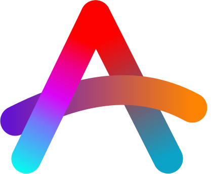

  

<h1 align="center">🌸 Hyprchan Waiting Repo 🌸</h1>

  <strong>Imagine if Hyprland had its own anime girl assistant...</strong> 
  <em>(Wait no longer, she's coming.)</em>

  
  
  

  Follow updates on X: <a href="https://x.com/HyprChan">@HyprChan</a>

---

### 📝 Project Vision

This repository is the temporary home for Hyprchan's development. Soon, this will transform into the official source code hub. Star ⭐ or follow to stay updated on the release!

> [!IMPORTANT]
> This project is **not** affiliated with the official Hyprland development team. It is a community-driven, unofficial companion.

---

### 🛠️ Devlog Highlights

  
✨ <strong>Refined Animations</strong>

  
Currently working on 10+ custom animations. Some are still a bit "sloppy" around the edges, but the refinement process is ongoing.

  

    
    
  

  
😴 <strong>Sleeping Loop</strong>

  
One of the most polished parts so far is the sitting sleep loop. It’s coming together!

  

    
  

---

  <a href="https://github.com/AscenderTeam">
     
    (made by Ascender Team)
  </a>

